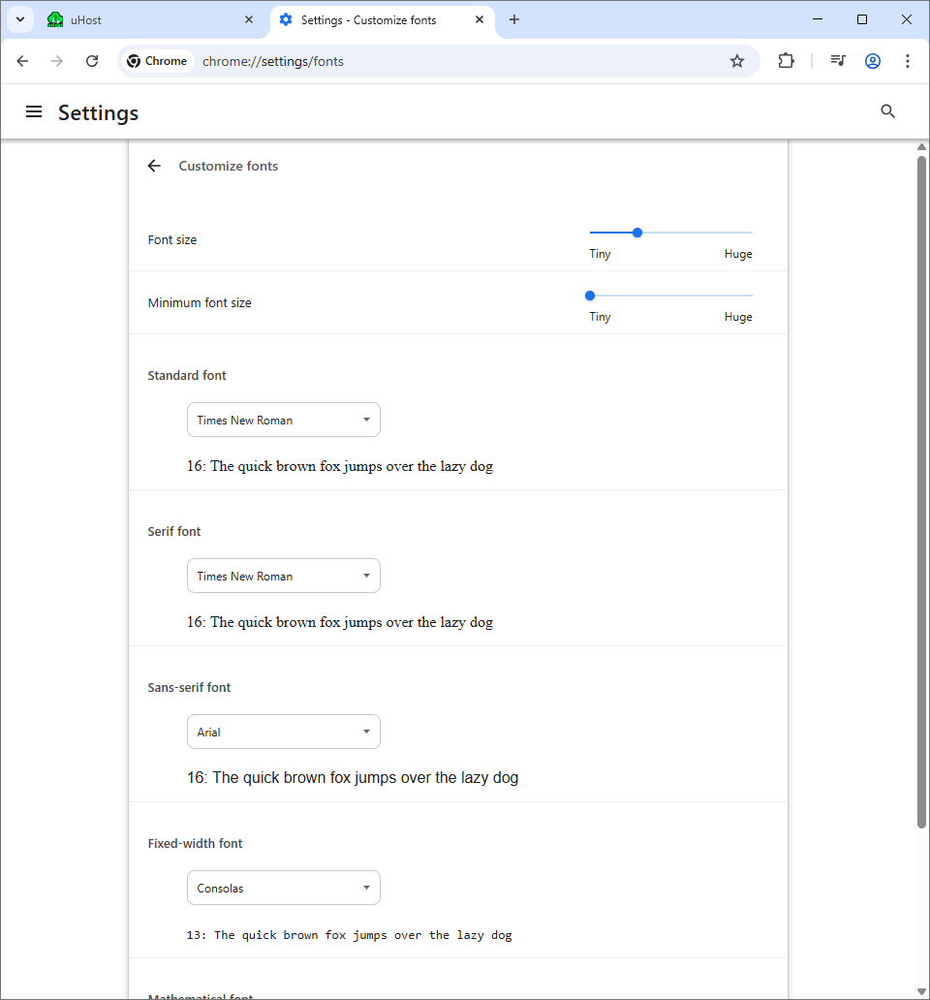

# 16. Applying Additional Styles and Importing Google Fonts

1. Okay so in this Video basically, we will be discussing on the property 
    1. color
    2. font-family - **sans-serif** This respective style is basically a special keyword which will use the **default set up in your browser**
    ```CSS
        h1 {
            color: white;
            font-family: sans-serif;
        }
    ```
2. The **sans-serif** can be found in your Google Chrome-> Setings -> Appearance

    1. If you don't assign a font family - It will use the **standard font**
    2. If you set it to **serif**
    3. If you set it to **sans-serif**
    4. **Monospace** is actually - **Fixed-width font**

3. Sometimes if so you want the specific font and you can't rely on the font being installed in the machine of the user. To include a font which is not installed already - You can use **Google Fonts**
```HTML
<head>
    <!-- Encoding which the HTML Follows -->
    <meta charset="UTF-8">
    <meta http-equiv="X-UA-Compatible" content="ie=edge">
    <title>uHost</title>
    <link rel="shortcut icon" href="favicon.png">
    <link rel="stylesheet" href="./16.main.css">
    <link href="https://fonts.googleapis.com/css2?family=Anton&display=swap" rel="stylesheet">
</head>
```
```CSS
section{
    background: #ff1b68;
}

h1 {
    color: white;
    font-family: "Anton", sans-serif;
}
```
In the above case, we have demonstrated on how to add a font called **Anton** from **Google Fonts**
    
From the above image, choose **Get Embeded code** and then choose the respective **<link>** and **CSS**


