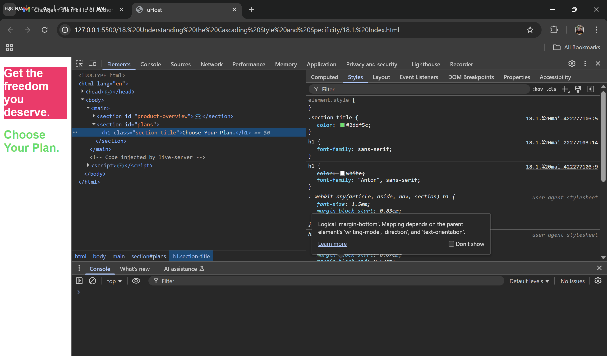

# 18. Understanding the Cascading Style and Specificity

1. Say you have the below **CSS Styles**
```CSS
#product-overview {
  background: #ff1b68;
}

h1 {
  color: white;
  font-family: "Anton", sans-serif;
}

.section-title {
  color: #2ddf5c;
}
```
As the CSS file gets paresed from top to bottom (the .section-title) overrides the previously written CSS rules for the h1 tag    
What if i try to do like below
```CSS
#product-overview {
  background: #ff1b68;
}

.section-title {
  color: #2ddf5c;
}

h1 {
  color: white;
  font-family: "Anton", sans-serif;
}

h1{
  font-family: sans-serif;
}
```
What if i try to place the (.section-title) before the h1 tag right, then what happens is that the color of the respective element will get affective but not the font-family -> for which h1 tag's CSS rules gets affected   
Two things are actually going on here,
1. Multiple Rules seems to affect the same element and also 
2. The different rules here seem to have different priorities

**GO TO INSPECT ELEMENT AND CHECK ON HOW THE CSS FILE IS GETTING PARSED**


1. As we can see from here, the section title has higher priority than all the font-style's that are available to h1 tags
2. And also the latest h1 tag, that is added will get applied to the respective element(I mean the **font-family**)
3. Also you can see that, there are some default CSS Rules that are applied internally. These will get applied if so **nothing overrides them**

NOTE - **Inline Selector > Class Selector > Element Selector**

**CSS - CASCADING STYLE SHEETS** - which means that **multiple styles (or) rules** can be **applied to the same element**

Now looking at our image, we can see that there are some conflicts that are there. CSS knows how to overcome these conflicts and which of them has compartively higher priorities

**Cascading** - Multiple Rules can be applied to the same element as we discussed above   
**Specificity** - Resolve Conflicts arising from multiple Rules

**Priority Order**    
**Inline Styles > #ID Selectors > .class, :pseudo-class and [attribute] selectors > <Tag> and ::pesudo-element selectors**


