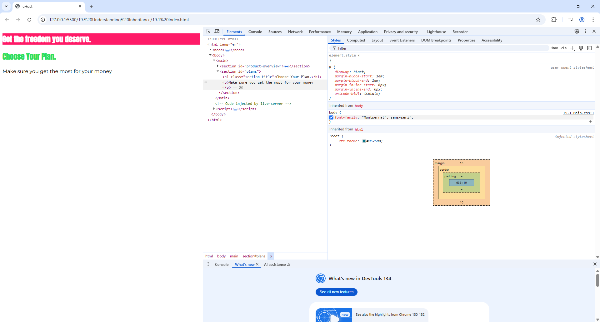

# 19. Understanding Inheritance

**So INHERITANCE IS AN IMPORTANT CONCEPT FOR PASSING STYLES DOWN WITHOUT EXPLICITLY SELECTING AN ELEMENT**  
**Especially for thing like**   
**1. Font-Style**   
**2. Font-Families**    
**A. Useful at the cases where you typically want to have a default style for each and every element on the body page of the screen**   
**B. If you want to have it for the entire page, the body section is a great place**   
**C. Any direct element selector has a higher specificity than inheritance**   

1. Here in the below CSS
```CSS
#product-overview {
    background: #ff1b68;
  }
  
.section-title {
    color: #2ddf5c;
}
  
h1 {
    color: white;
    font-family: "Anton", sans-serif;
}
  
/* h1 {
    font-family: sans-serif;
} */
```
1. If we remove the last **font-family** CSS Rule then the previously declared **Anton Font-Family** will get affected

2. **THE PROBLEM WITH (*) SELECTOR**        
    A. **Performance Issues and computationally expensive for large and complex web pages. Also it can slow down rendering** - It is very difficult to parse each and every element on the screen   
    B. We will use it but not for a global font family      
    C. Because of which we change the style of the body which takes care of all the other elements which are inside the **body tag**    

3. **INHERITANCE**
We have imported an external font-family from **google Fonts**
```CSS
body {
    font-family: "Montserrat", sans-serif;
}
#product-overview {
    background: #ff1b68;
  }
  
.section-title {
    color: #2ddf5c;
}
  
h1 {
    color: white;
    font-family: "Anton", sans-serif;
}
  
/* h1 {
    font-family: sans-serif;
} */
```  
    
    A. Elements inherit styles from their parents, direct/indirect parents and not just from the body   
    B. Here in our above example, the body is no direct parent of h1 but it is a parent in the chain of elements here   
    C. So some styles **especially the font-related styles** are passed down to the child   
    D. However **Inheritance have very low specificity** - It comes down at the bottom of the browser   

NOTE:- **Whenever you directly select an element, this has a higher specificity than inheritance where you don't direcly select an element**

4. Now what we do is we add a paragraph tag to our html
``` HTML
<body>
  <main>
    <section id="product-overview">
      <h1>Get the freedom you deserve.</h1>
    </section>
    <section id="plans">
      <h1 class="section-title">Choose Your Plan.</h1>
      <p>Make sure you get the most for your money</p>
    </section>
  </main>
</body>
```     

Now if we reload our page again and then look into the Styles applied for the **paragraph tag** we get to know the **Monserrat** is applied         
You can also check it by **unticking the font-style** that is applied

