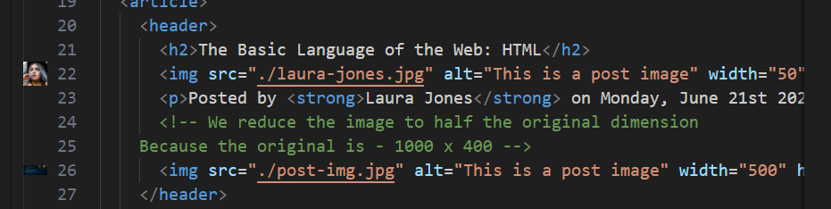

# 17. Installing Additional VS Code Extenstions

### 1. Add the **image preview**


### 2. Add the **Color Highlight**  
This is useful only for **CSS**  

### 3. Auto **Rename Tag**
Add the **Auto Rename Tag**
```HTML
<div>
    <h1>HEllo</h1>
</div>
```
* Modifying the **Div** to **H1** the closing tag will automatically get changed 
* It will also automatically close the element for us


