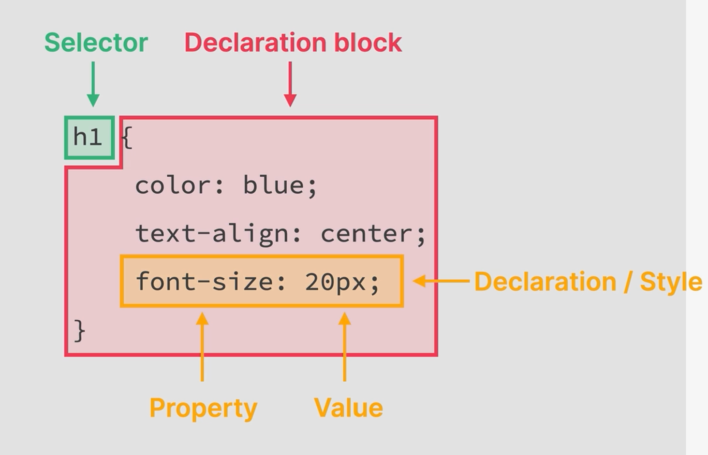

# 21. Introduction to CSS

CSS- This basically describes the **visual style** and **presentation** of the content written in HTML

CSS - Consists of countless properties that these developers use to format the content. Properties about 
  1. Font
  2. Text
  3. Spacing
  4. Layout

```CSS
/* Here the below h1 is called as the Selector */
h1{
  color : blue;
  text-align: center;
  /* Here the 
  1. font-size - This is the property
  2. 20px - This is the value */
  font-size: 20px; /* Each line is called as Declaration/Style */
}
```
> The whole content inside the curly braces is called the **Declaration Block**

So basically a **Selector+Declaration block** is what we call a **CSS Rule**


