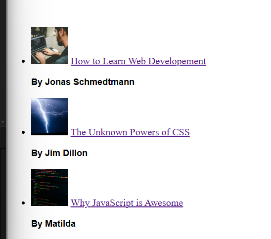
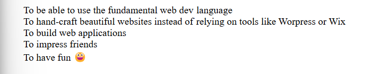
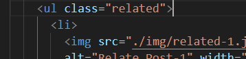

# 25. Class and ID Selectors 

1. So we have a drawback here, in order to style the para tag which is inside the article->header->p we use the below CSS
```CSS
article header p {
  font-style: italic;
}
```
* The above written CSS exposes our HTML structure for that particular element which is actually not a good idea 

2. Difference between class and id attribute is that 
  * We aren't allowed to repeat id names(We can use each id name only once)
  * Whereas we are allowed to repeat class names(If so we need to use a styling keyword at multiple places it's better to use classes)

3. How we actually use and id attribute and class attribute
```HTML
  <p id="author">Posted by <strong>Laura Jones</strong> on Monday, June 21st 2027
  </p>
  <p id="Copyright">
    Copyright &copy; 2007 by the code magazine
  </p>
```
```CSS
#author {
  font-style: italic;
  font-size: 18px;
}

#Copyright {
  font-size: 16px;
}
```

```HTML
  <p class="related-author">By Jonas Schmedtmann</p>
  <p class="related-author">By Jim Dillon</p>
  <p class="related-author">By Matilda</p>
```
```CSS
.related-author {
  font-size: 18px;
  font-weight: bold;
}
```


4. How to make the bullet points in the list invisible
```CSS
ul {
  list-style: none;
}
```


5. Why we used class and not Id

This is because id's aren't reusable where class attribute can be reused in our index.html i do have another block
```HTML
  <ul>
    <li>
      To be able to use the fundamental web dev language
    </li>
    <li> To hand-craft beautiful websites instead of relying on tools like Worpress or Wix</li>
    <li> To build web applications</li>
    <li>To impress friends</li>
    <li>To have fun 😃</li>
  </ul>
```
Suppose say i want to remove the bulleting for this block, i can use the same class here again 

Generally we don't use id attribute that much in HTML - for future conventions suppose say in future i have something in the sidedbar or so which uses the same css i can use the same class attribute and apply the respective css to the particular HTML block


